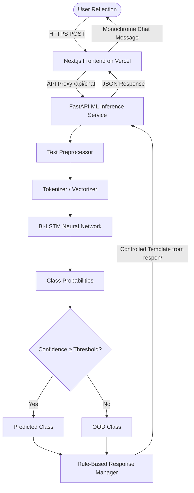

# MindCare — Deep Learning Mental Health Chatbot

> A research-grade, modern web-based text classification assistant designed to categorize user reflections and provide safe, controlled, empathetic responses.

---

## 1. Project Overview

**MindCare** is an academic Deep Learning application built with a modern **Next.js + React + TypeScript + Tailwind CSS** frontend deployed on **Vercel**, and a decoupled **FastAPI + TensorFlow / Keras** inference backend.

Unlike generative Large Language Models (LLMs) that may hallucinate or provide unpredictable therapeutic advice, MindCare implements a **strictly controlled, classification-and-retrieval architecture**:

1. **User Reflection**: The user shares thoughts through a minimalist, monochrome chat interface.
2. **Deep Learning Classification (Bi-LSTM)**: The backend processes the text and classifies it into one of **8 predefined categories** (5 mental-health classes and 3 supporting classes).
3. **Controlled Response Mapping**: The predicted class is deterministically mapped to **vetted, safe response templates** stored in the `respon/` directory.
4. **Crisis Safety Protocols**: High-risk categories such as suicide ideation immediately activate emergency crisis lifelines without pretending to be a licensed therapist.

---

## 2. Core Architecture

The system maintains a clean decoupling between the Vercel-hosted presentation layer and the machine learning intelligence layer:



### Architecture Breakdown:

- **Frontend (Vercel)**: Next.js 14 App Router, React 18, TypeScript, and Tailwind CSS. Provides an Apple-inspired black-and-white monochrome design, responsive drawer sidebar, session-based chat state, and an optional developer inspection mode.
- **API Abstraction (`frontend/lib/api.ts`)**: Handles client-to-API communication with typed interfaces and graceful error fallbacks.
- **Backend API (`backend/server.py`)**: Lightweight FastAPI server exposing `/health` and `/api/chat` endpoints with input validation and CORS management.
- **ML Pipeline (`model/`, `preprocessing/`)**: Custom text normalization regex pipeline, Keras tokenizer wrapper, Bi-LSTM forward pass, and OOD threshold logic.
- **Controlled Response Store (`respon/`)**: Plain-text response templates for each category.

---

## 3. Classification Categories

The classification engine is configured for 8 mutually exclusive categories:

| Category | Type | Description | Source Dataset |
|---|---|---|---|
| **Addiction** | Mental Health | Substance dependency, craving, behavioral addiction | `dataset_chat/FullAddiction.csv` |
| **Anxiety** | Mental Health | Panic, restlessness, physical tension, hyperventilation | `dataset_chat/FullAnxiety.csv` |
| **Depression** | Mental Health | Sadness, hopelessness, emotional exhaustion, emptiness | `dataset_chat/FullDepression.csv` |
| **Eating Disorder** | Mental Health | Body image distress, calorie fixation, disordered eating | `dataset_chat/FullEatingDisorder.csv` |
| **Suicide** | High Risk / Crisis | Suicide ideation, self-harm crisis (**Urgent Protocol**) | `dataset_chat/FullSuicide.csv` |
| **Neutral** | Supporting | Everyday routine, non-acute conversational reflection | `daily_chat/train.csv` |
| **OOD** | Supporting | Out-of-distribution (e.g., news, sports, tech, corporate) | `worng_context/train.csv` |
| **Greeting** | Supporting | Greetings, salutations, opening conversational prompts | `daily_chat/train.csv` |

---

## 4. Model Architecture & Specifications

The classification engine uses a **Bidirectional Long Short-Term Memory (Bi-LSTM)** neural network trained in TensorFlow / Keras:

- **Architecture**: `Embedding -> Bidirectional(LSTM) -> Dropout(0.3) -> Dense(64, ReLU) -> Dropout(0.2) -> Dense(8, Softmax)`
- **Vocabulary Size**: 15,000 words mapped to 64-dimensional dense vectors.
- **Sequence Length**: Padded and truncated to a maximum of 100 tokens.
- **LSTM Units**: 64 units per direction (128 combined dimensions).
- **Optimizer**: Adam ($\text{learning rate} = 0.001$).
- **Loss Function**: Sparse Categorical Crossentropy.
- **Confidence Threshold**: $0.35$ (predictions with maximum softmax probability below 35% trigger Out-of-Distribution fallback).
- **Inference Latency**: $\approx 85\text{ ms}$ on local CPU.

---

## 5. Repository Structure

```text
DeepLearningMentalHealth/
│
├── vercel.json                 # Vercel deployment configuration
├── requirements.txt           # Python backend dependencies (FastAPI, TF, etc.)
├── README.md                  # Comprehensive system documentation
├── .gitignore                 # Excluded files (node_modules, models, cache)
│
├── frontend/                  # Next.js Web Application
│   ├── app/
│   │   ├── layout.tsx         # Root layout with Inter font and metadata
│   │   ├── page.tsx           # Main chat page and session state
│   │   ├── globals.css        # Global CSS and custom scrollbars
│   │   └── api/
│   │       ├── chat/route.ts  # Next.js API proxy to Python inference service
│   │       └── health/route.ts# Health proxy and fallback status provider
│   ├── components/
│   │   ├── Chat/
│   │   │   ├── ChatWindow.tsx # Scrollable conversation container
│   │   │   ├── ChatMessage.tsx# Monochrome bubbles & crisis card layout
│   │   │   ├── ChatInput.tsx  # Dynamic expanding input & send trigger
│   │   │   └── EmptyState.tsx # Welcome screen with 4 quick prompts
│   │   ├── Sidebar/
│   │   │   ├── Sidebar.tsx    # Desktop sidebar & mobile drawer
│   │   │   ├── ModelStatus.tsx# Live model specification card
│   │   │   └── SafetyNotice.tsx# Crisis helpline and prototype disclaimer
│   │   └── UI/
│   │       ├── Button.tsx     # Monochrome button primitive
│   │       ├── Card.tsx       # Bordered container primitive
│   │       └── StatusIndicator.tsx # Monochrome status badge
│   ├── lib/
│   │   ├── api.ts             # Typed fetch abstraction
│   │   ├── config.ts          # Branding strings and default labels
│   │   └── types.ts           # Strict TypeScript interfaces
│   ├── tailwind.config.ts     # Pure black/white & grayscale palette tokens
│   ├── tsconfig.json          # Strict TypeScript configuration
│   └── package.json           # Next.js 14 and React 18 dependencies
│
├── backend/                   # Python ML Inference API
│   ├── server.py              # FastAPI server (CORS, health, predict)
│   └── __init__.py
│
├── config/
│   ├── config.py              # Centralized paths, thresholds, and labels
│   └── __init__.py
│
├── model/
│   ├── model_config.py        # Model hyperparameters and metadata
│   ├── model_loader.py        # Cached artifact loader (Keras & PyTorch)
│   ├── predictor.py           # End-to-end inference and OOD detection
│   └── __init__.py
│
├── preprocessing/
│   ├── text_preprocessor.py   # Regex text normalization pipeline
│   ├── tokenizer.py           # Keras tokenizer wrapper
│   └── __init__.py
│
├── response/
│   ├── response_loader.py     # Template parser and memory cache
│   ├── response_manager.py    # Class-to-response mapping and safety checks
│   └── __init__.py
│
├── respon/                    # Vetted response text files (8 categories)
│   ├── addiction.txt
│   ├── anxiety.txt
│   ├── depression.txt
│   ├── eating_disorder.txt
│   ├── suicide.txt            # Dedicated crisis safety protocol
│   ├── neutral.txt
│   ├── greeting.txt
│   └── ood.txt
│
├── models/                    # Exported model weights & tokenizer
│   ├── model_final.h5         # Trained Keras Bi-LSTM model
│   ├── tokenizer.pickle       # Pickled tokenizer artifact
│   └── model_metadata.json    # Hyperparameters & evaluation metrics
│
├── scripts/
│   └── train_model.py         # Reproducible training & export script
│
└── tests/
    ├── eval_classes.py        # Comprehensive 8-class verification script
    └── test_pipeline.py       # Automated unit test suite
```

---

## 6. Installation & Local Development

### Prerequisites
- **Node.js** 18.17+ and **npm**
- **Python** 3.8 to 3.10
- Virtual environment tool (`venv` or `conda`)

---

### Step 1: Set Up Backend (Python FastAPI)

1. Open a terminal in the project root and create a virtual environment:
   ```bash
   python -m venv venv
   # On Windows:
   venv\Scripts\activate
   # On macOS/Linux:
   source venv/bin/activate
   ```

2. Install backend dependencies:
   ```bash
   pip install -r requirements.txt
   ```

3. Launch the FastAPI inference server:
   ```bash
   python -m backend.server
   ```
   *The backend will start at `http://127.0.0.1:8000`.*
   *Verify health at: `http://127.0.0.1:8000/health`.*

---

### Step 2: Set Up Frontend (Next.js)

1. In a second terminal, navigate to the `frontend/` directory:
   ```bash
   cd frontend
   npm install
   ```

2. Create a local environment file `.env.local` inside `frontend/`:
   ```env
   MODEL_API_URL=http://127.0.0.1:8000
   NEXT_PUBLIC_API_URL=http://127.0.0.1:8000
   ```

3. Start the Next.js development server:
   ```bash
   npm run dev
   ```

4. Open [http://localhost:3000](http://localhost:3000) in your browser.

---

## 7. Production Deployment

### Architecture

```text
┌─────────────────────────────┐
│          VERCEL             │
│                             │
│ Next.js 14 Frontend         │
│ React + TypeScript          │
│ Tailwind CSS Monochrome     │
└──────────────┬──────────────┘
               │
               │ HTTPS (MODEL_API_URL)
               ▼
┌─────────────────────────────┐
│  PYTHON INFERENCE SERVICE   │
│  (Hugging Face / Render)    │
│                             │
│ FastAPI Server              │
│ TensorFlow / Keras          │
│ Bi-LSTM (model_final.h5)    │
│ respon/ Templates           │
└─────────────────────────────┘
```

### 1. Deploy Frontend to Vercel

1. Push your repository to GitHub.
2. In the **Vercel Dashboard**, click **Add New Project** and import your repository.
3. The root configuration is automatically handled by the included [`vercel.json`](file:///f:/KODINGAN/KODING%20KODINGAN%20SMTER%205/PROYEK%20DEEP%20LEARNING/vercel.json):
   ```json
   {
     "framework": "nextjs",
     "buildCommand": "cd frontend && npm install && npm run build",
     "outputDirectory": "frontend/.next"
   }
   ```
4. Set the **Environment Variables** in Vercel:
   - `MODEL_API_URL` = URL of your deployed Python inference service (e.g., `https://mindcare-api.onrender.com`).
5. Click **Deploy**.

---

### 2. Deploy Backend (Inference Service)

Because TensorFlow and deep learning weights require dedicated memory and CPU that exceed standard Vercel serverless function limits (250MB maximum), deploy `backend/server.py` to a Python host:

#### Option A: Hugging Face Spaces *(Free & Recommended for ML)*
1. Create a new Space on [Hugging Face Spaces](https://huggingface.co/spaces) with SDK set to **Docker** or **Gradio/FastAPI**.
2. Upload the repository code (`backend/`, `model/`, `models/`, `preprocessing/`, `response/`, `respon/`, `config/`, `utils/`, `requirements.txt`).
3. Set the start command:
   ```bash
   uvicorn backend.server:app --host 0.0.0.0 --port 7860
   ```
4. Copy the public Space URL and paste it into Vercel's `MODEL_API_URL` environment variable.

#### Option B: Render.com or Railway.app
1. Create a new **Web Service** connected to your repository.
2. Build command: `pip install -r requirements.txt`
3. Start command: `uvicorn backend.server:app --host 0.0.0.0 --port $PORT`
4. Set your production frontend domain in `ALLOWED_ORIGINS` for strict CORS.

---

## 8. Testing & Evaluation

### 1. Run Automated Unit & Pipeline Tests
```bash
python tests/test_pipeline.py
```
*Validates text cleaning, tokenization sequence shapes, model inference, and response mapping (19 tests).*

### 2. Evaluate All 8 Classes
```bash
python tests/eval_classes.py
```
*Executes queries for all 8 categories, verifying confidence scores, latency (~85ms), and crisis protocol activation on Suicide queries.*

### 3. Verify Frontend Production Build
```bash
cd frontend
npm run build
```
*Ensures zero TypeScript or Next.js build errors.*

---

## 9. AI Usage Log

In accordance with academic integrity guidelines:
- **Architecture Design**: AI assistance was utilized to design the decoupled Next.js + FastAPI system architecture and monochrome design tokens.
- **Frontend Scaffolding**: AI assistance helped build the Next.js 14 App Router structure, TypeScript interfaces, and Tailwind CSS components.
- **Model Pipeline**: The Bi-LSTM neural network architecture, data balancing, and Keras training script were implemented for deep learning research and evaluation.

---

## 10. Limitations & Ethical Notice

- **Academic Prototype**: MindCare is an academic research prototype designed to study controlled NLP classification techniques for sensitive reflections.
- **Not Medical Advice**: MindCare does **not** provide psychological diagnosis, medical treatment, or therapy.
- **Emergency Situations**: Individuals experiencing an acute mental health crisis or thoughts of self-harm should immediately reach out to local emergency services:
  - **US / Canada**: Call or text `988` (Suicide & Crisis Lifeline)
  - **Indonesia**: Call `119 ext. 8` (Layanan SEJIWA)
  - **United Kingdom**: Call `111` or text `SHOUT` to `85258`
  - **Global**: Visit [findahelpline.com](https://findahelpline.com/)
